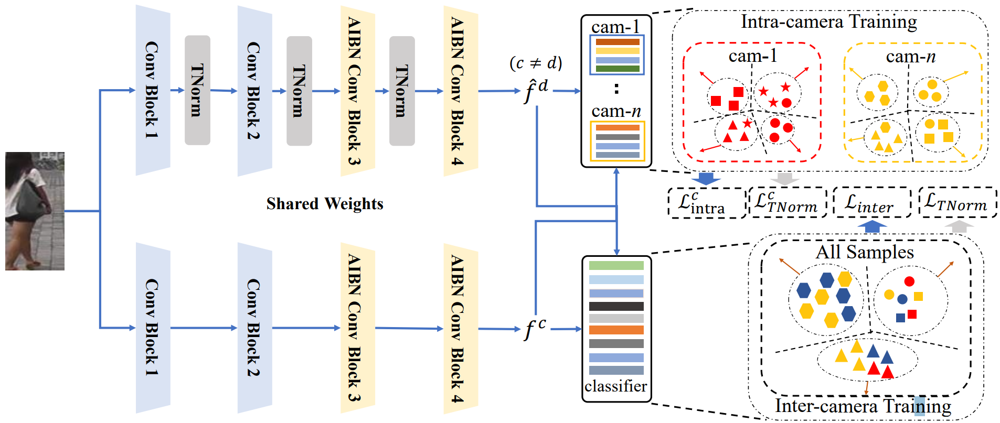

# IIDS
Pytorch implementation of Paper ["Intra-Inter Camera Similarity for Unsupervised Person Re-Identification"](https://ieeexplore.ieee.org/abstract/document/9745321) (TPAMI 2022)

This is the extended version of IICS on CVPR2021



## Installation
### 1. Clone code
```
    git clone git@github.com:SY-Xuan/IIDS.git
    cd ./IIDS
```

### 2. Install dependency python packages
```
    conda create --name IIDS --file requirements.txt
``` 

### 3. Prepare dataset
Download Market1501, DukeMTMC-ReID, MSMT17 from website and put the zip file under the directory like
```
./data
├── dukemtmc
│   └── raw
|       └──DukeMTMC-reID.zip
├── market1501
|   └── raw
│       └── Market-1501-v15.09.15.zip
|── msmt17
|   └── raw
|       └── MSMT17_V2.zip
```
## Usage
### 1. Download trained model
* [Market1501](https://pkueducn-my.sharepoint.com/:f:/g/personal/shiyu_xuan_stu_pku_edu_cn/EuaJrwvGqnpJo2vc851CmnkBZFK2VjU2pbs0YXIfOItsSg?e=rA41MH)
* [DukeMTMC-ReID](https://pkueducn-my.sharepoint.com/:f:/g/personal/shiyu_xuan_stu_pku_edu_cn/EuaJrwvGqnpJo2vc851CmnkBZFK2VjU2pbs0YXIfOItsSg?e=rA41MH)
* [MSMT17](https://pkueducn-my.sharepoint.com/:f:/g/personal/shiyu_xuan_stu_pku_edu_cn/EuaJrwvGqnpJo2vc851CmnkBZFK2VjU2pbs0YXIfOItsSg?e=rA41MH)

### 2. Evaluate Model
Change the checkpoint path in the ./script/test_market.sh
```
sh ./script/test_market.sh
```

### 3. Train Model
You need to download ResNet-50 imagenet pretrained model and change the checkpoint path in the ./script/train_market.sh
```
sh ./script/train_market.sh
```

## Results
|Datasets | mAP | Rank@1| Method |
| :--------: | :-----: | :----: | :----: |
|Market1501 | 72.9% | 89.5% | CVPR2021 |
|Market1501 | 78.0% | 91.2% | This Version |
|DukeMTMC-ReID | 64.4% | 80.0% | CVPR2021 |
|DukeMTMC-ReID | 68.7% | 82.1% | This Version |
|MSMT17 | 26.9% | 56.4% | CVPR2021 |
|MSMT17 | 35.1% | 64.4% | This Version |

## Citations
If you find this code useful for your research, please cite our paper:

```
@ARTICLE{9745321,
  author={Xuan, Shiyu and Zhang, Shiliang},
  journal={IEEE Transactions on Pattern Analysis and Machine Intelligence}, 
  title={Intra-Inter Domain Similarity for Unsupervised Person Re-Identification}, 
  year={2022},
  volume={},
  number={},
  pages={1-1},
  doi={10.1109/TPAMI.2022.3163451}}

@inproceedings{xuan2021intra,
  title={Intra-inter camera similarity for unsupervised person re-identification},
  author={Xuan, Shiyu and Zhang, Shiliang},
  booktitle={Proceedings of the IEEE/CVF Conference on Computer Vision and Pattern Recognition},
  pages={11926--11935},
  year={2021}
}
```
## Contact me
If you have any questions about this code or paper, feel free to contact me at
shiyu_xuan@stu.pku.edu.cn.

## Acknowledgement
Codes are built upon [open-reid](https://github.com/Cysu/open-reid).